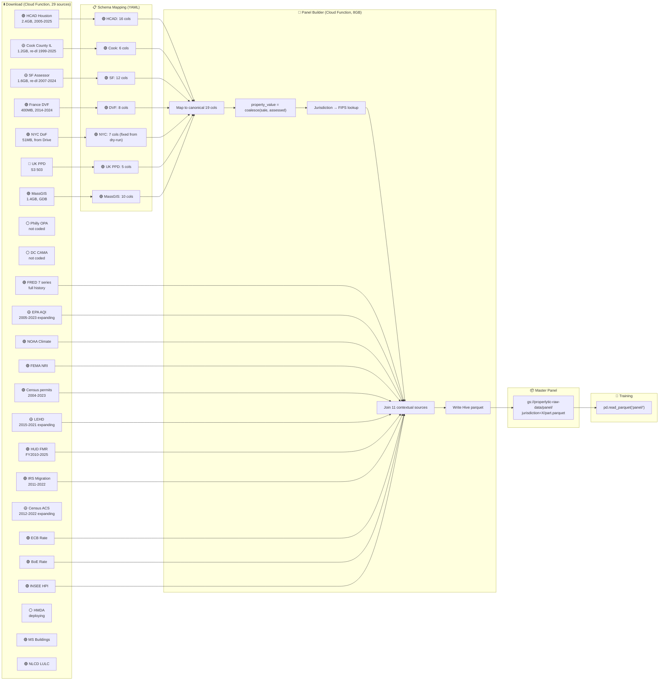

# ETL Pipeline DAG — Status Board
**Updated:** 2026-02-26T13:53Z

## Pipeline DAG



## Per-Source Pipeline Status

🟢 Done | 🟡 In progress | 🔴 Failed | ⚪ Not started

### Parcel Sources

| Source | ⬇️ Download | 📋 Schema | 🔧 Builder | 🧪 Dry-run | 📦 Panel |
|--------|------------|-----------|------------|----------|---------|
| HCAD Houston | 🟢 2.4GB | 🟢 16 cols | 🟢 | 🔴 OOM→8GB retry | ⚪ |
| Cook County IL | 🟡 re-dl | 🟢 19 cols | 🟢 | 🔴 OOM→8GB retry | ⚪ |
| SF Assessor | 🟡 re-dl | 🟢 45 cols | 🟢 | 🟢 **verified** | ⚪ |
| France DVF | 🟢 2014-24 | 🟢 35 cols | 🟢 | 🔴 OOM→8GB retry | ⚪ |
| NYC DoF | 🟢 51MB | 🟢 7 cols (BBL) | 🟢 (fixed) | 🟢 **verified** | ⚪ |
| MassGIS L3 | 🟢 1.4GB | 🟢 docs | 🔴 GDB | ⚪ | ⚪ |
| UK PPD | 🔴 S3 503 | 🟢 docs | 🟢 | ⚪ | ⚪ |
| Philly OPA | ⚪ | ⚪ | ⚪ | ⚪ | ⚪ |
| Washington DC | ⚪ | ⚪ | ⚪ | ⚪ | ⚪ |

### Contextual Sources

| Source | ⬇️ Download | Join Level | Join Key | 🔧 In Builder | Years |
|--------|------------|-----------|----------|--------------|-------|
| FRED (7 series) | 🟢 | national | year | 🟢 | 1947-2025 |
| ECB MRO rate | 🟢 | national_eu | year | 🟢 (France) | 1999-2025 |
| BoE Bank Rate | 🟢 | national_uk | year | 🟢 (UK) | 1975-2026 |
| INSEE HPI | 🟢 | national_fr | year | 🟢 (France) | 1996-2024 |
| EPA AQI | 🟡 2005-23 | county | FIPS+year | 🟢 | 2005-2023 |
| NOAA Climate | 🟢 | county | FIPS+year | 🟢 | 1895-2025 |
| FEMA NRI | 🟢 | county | FIPS | 🟢 | static |
| Census permits | 🟢 2004-23 | county | FIPS+year | 🟢 | 2004-2023 |
| LEHD jobs | 🟡 2015-21 | state | state_fips | 🟢 | 2015-2021 |
| HUD FMR | 🟢 FY10-25 | county | FIPS | 🟢 | 2010-2025 |
| IRS Migration | 🟢 2011-22 | county | FIPS | 🟢 | 2011-2022 |
| Census ACS | 🟡 2012-22 | **tract** | **needs geocode** | ⚪ | 2012-2022 |
| HMDA mortgage | ⚪ deploying | **tract** | **needs geocode** | ⚪ | 2018-2023 |
| MS Buildings | 🟢 | **parcel** | **spatial** | ⚪ | 2023 |
| NLCD LULC | 🟢 | **parcel** | **raster** | ⚪ | 2021 |

### Target Variable

```
property_value = COALESCE(sale_price, assessed_value)
```

| Source | sale_price | assessed_value | property_value |
|--------|-----------|---------------|----------------|
| HCAD | ❌ | ✅ tot_appr_val | ✅ assessed |
| Cook County | ❌ | ✅ certified_tot | ✅ assessed |
| SF | ❌ | ✅ land+improvement | ✅ assessed |
| France DVF | ✅ valeur_fonciere | ❌ | ✅ sale |
| NYC | ✅ SALE_PRICE | ❌ | ✅ sale |
| UK PPD | ✅ price | ❌ | ✅ sale |

## Active Jobs

| Job | Status | Started |
|-----|--------|---------|
| Cook County re-download (1999-2025) | 🟡 | 12:50Z |
| SF re-download (2007-2024) | 🟡 | 12:50Z |
| Census ACS (2012-2022, 33 files) | 🟡 | 13:37Z |
| LEHD (2015-2021, 49 files) | 🟡 | 13:37Z |
| Both CFs redeploying | 🟡 | pending |
| Panel build (all sources) | ⚪ | after deploy |

## Blockers

| Issue | Impact | Fix |
|-------|--------|-----|
| HCAD/Cook/DVF OOM at 4GB | Can't build 3 of 6 panels | ✅ Upgraded to 8GB, redeploy pending |
| UK PPD download 503 | No UK data | Need alt URL (gov.uk HTTPS) |
| Census ACS needs tract geocoding | County-level fallback possible | Can aggregate to county for now |
| MassGIS is GDB format | Skipped in panel builder | Needs geopandas/fiona |
| MS Buildings needs spatial join | Not in panel | Needs geopandas |
