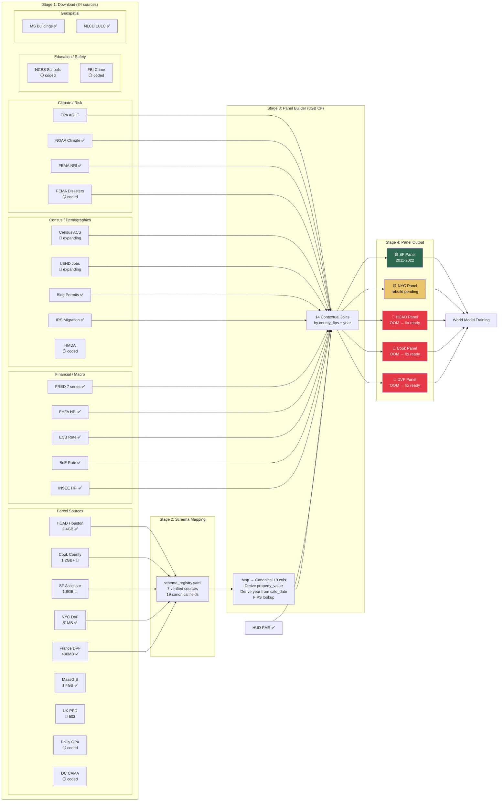

# Properlytic ETL Pipeline
**GCS Bucket:** `gs://properlytic-raw-data` | **Project:** `properlytic-data` | **Updated:** 2026-02-26T19:30Z



## 1. Download (Cloud Function: `gcf_download/main.py`, 34 sources)

### 1a. Parcel Sources

| # | Source | URL / API | GCS Path | Format | Size | Years | Status |
|---|--------|-----------|----------|--------|------|-------|--------|
| 1 | HCAD Houston | pdata.hcad.org | `hcad/*.parquet` | Parquet | 2.4 GB | 2005-2025 | 🟢 |
| 2 | Cook County IL | data.cookcountyil.gov | `cook_county_il/assessed_values/` | CSV chunked | 1.2 GB+ | 1999-2025 | 🟡 re-dl |
| 3 | SF Assessor | data.sfgov.org (wv5m-vpq2) | `sf/secured_roll/` | CSV chunked | 1.6 GB | 2007-2024 | 🟡 re-dl |
| 4 | France DVF | files.data.gouv.fr/geo-dvf | `france_dvf/{year}_full.csv.gz` | CSV.GZ | 400 MB | 2014-2024 | 🟢 expanded |
| 5 | NYC DoF | nyc.gov/finance (from Drive) | `nyc/nyc_sales_clean.parquet` | Parquet | 51 MB | multi-year | 🟢 |
| 6 | MassGIS L3 | mass.gov/massgis | `massgis/*.gdb.zip` | GDB ZIP | 1.4 GB | 2020-2024 | 🟢 |
| 7 | UK PPD | prod.publicdata.landregistry.gov.uk | `uk_ppd/pp-complete.csv` | CSV | — | 1995-2025 | 🔴 S3 503 |
| 8 | Philly OPA | phl.carto.com | `philly/opa_assessments` | CSV | — | — | ⚪ coded |
| 9 | Washington DC | opendata.dc.gov | `dc/cama_residential` | CSV | — | — | ⚪ coded |

### 1b. Financial / Market Context

| # | Source | URL | GCS Path | Join Level | Years | Status |
|---|--------|-----|----------|-----------|-------|--------|
| 10 | FRED 30yr mortgage | fred.stlouisfed.org | `fred/MORTGAGE30US.csv` | national, year | 1971-2025 | 🟢 |
| 11 | FRED 10yr treasury | fred.stlouisfed.org | `fred/DGS10.csv` | national, year | 1962-2025 | 🟢 |
| 12 | FRED fed funds | fred.stlouisfed.org | `fred/FEDFUNDS.csv` | national, year | 1954-2025 | 🟢 |
| 13 | FRED CPI | fred.stlouisfed.org | `fred/CPIAUCSL.csv` | national, year | 1947-2025 | 🟢 |
| 14 | FRED unemployment | fred.stlouisfed.org | `fred/UNRATE.csv` | national, year | 1948-2025 | 🟢 |
| 15 | FRED Case-Shiller | fred.stlouisfed.org | `fred/CSUSHPINSA.csv` | national, year | 1987-2025 | 🟢 |
| 16 | FRED FHFA HPI | fred.stlouisfed.org | `fred/USSTHPI.csv` | national, year | 1975-2025 | 🟢 |
| 17 | ECB MRO rate | sdw.ecb.europa.eu | `ecb/ecb_mro_rate.csv` | national_eu, year | 1999-2025 | 🟢 |
| 18 | BoE Bank Rate | bankofengland.co.uk | `boe/bank_rate.csv` | national_uk, year | 1975-2026 | 🟢 |
| 19 | INSEE HPI | insee.fr | `insee/insee_hpi_national.csv` | national_fr, year | 1996-2024 | 🟢 |

### 1c. Census / Demographics / Employment

| # | Source | URL | GCS Path | Join Level | Join Key | Years | Status |
|---|--------|-----|----------|-----------|----------|-------|--------|
| 20 | Census ACS (pop/income/value) | census.gov | `census/{yr}_ACS_{table}.zip` | tract | tract_fips (needs geocode) | 2012-2022 | 🟡 expanding |
| 21 | Building permits | census.gov/econ/bps | `census/building_permits_{yr}.txt` | county | county_fips + year | 2004-2023 | 🟢 |
| 22 | LEHD jobs | lehd.ces.census.gov | `lehd/{st}_wac_{yr}.csv.gz` | state (agg) | state_fips | 2015-2021 | 🟡 expanding |
| 23 | IRS Migration | irs.gov/pub/irs-soi | `irs/migration_{flow}_{tag}.csv` | county | county_fips | 2011-2022 | 🟢 |
| 24 | HMDA mortgage | ffiec.cfpb.gov | `hmda/hmda_lar_{yr}.zip` | tract | tract_fips (needs geocode) | 2018-2023 | ⚪ coded |

### 1d. Climate / Environment / Risk

| # | Source | URL | GCS Path | Join Level | Join Key | Years | Status |
|---|--------|-----|----------|-----------|----------|-------|--------|
| 25 | EPA AQI | aqs.epa.gov | `epa/annual_aqi_by_county_{yr}.zip` | county | county_fips + year | 2005-2023 | 🟡 expanding |
| 26 | NOAA Climate | ncdc.noaa.gov | `climate/*.csv` | county | county_fips + year | 1895-2025 | 🟢 |
| 27 | FEMA NRI | hazards.fema.gov | `fema/NRI_CensusTracts.zip` | county (agg) | county_fips | static v1.20 | 🟢 |
| 28 | FEMA Disasters | fema.gov/api/open | `fema/disaster_declarations.csv` | county | county_fips | 1953-present | ⚪ coded |

### 1e. Housing Market

| # | Source | URL | GCS Path | Join Level | Join Key | Years | Status |
|---|--------|-----|----------|-----------|----------|-------|--------|
| 29 | HUD FMR | huduser.gov | `hud/FY{yr}_FMR_county.xlsx` | county | county_fips | FY2010-2025 | 🟢 |

### 1f. Education / Safety

| # | Source | URL | GCS Path | Join Level | Years | Status |
|---|--------|-----|----------|-----------|-------|--------|
| 30 | NCES Schools | nces.ed.gov | `nces/ccd_schools_2223.zip` | ZIP/county | 2022-23 | ⚪ coded |
| 31 | FBI Crime | cde.ucr.cjis.gov | `fbi/estimated_crimes_{yr}.csv` | county | 2015-2022 | ⚪ coded |

### 1g. Geospatial

| # | Source | URL | GCS Path | Join Level | Join Key | Status |
|---|--------|-----|----------|-----------|----------|--------|
| 32 | MS Buildings | usbuildingdata.blob.core.windows.net | `buildings/*.geojson.zip` | parcel (spatial) | lat/lon | 🟢 |
| 33 | NLCD LULC | mrlc.gov | `lulc/nlcd_2021*.zip` | parcel (raster) | lat/lon | 🟢 |

---

## 2. Schema Mapping (`schema_registry.yaml`)

Each parcel source maps raw columns → 19 canonical fields. Verified against actual data.

| Source | Canonical Cols Mapped | Verified | Method | Date |
|--------|----------------------|----------|--------|------|
| HCAD | `acct→parcel_id, yr→year, tot_appr_val→assessed_value, land_val, impr_val, state_class→dwelling_type, living_area→sqft, land_ar→land_area, yr_blt→year_built, bed_cnt→bedrooms, site_addr_1→address, lat, lon` + derived `bathrooms, stories` | ✅ | GCS parquet inspect | 2/25 |
| Cook County | `pin→parcel_id, year→year, class→dwelling_type, certified_bldg→improvement_value, certified_land→land_value, certified_tot→assessed_value` | ✅ | GCS CSV inspect | 2/25 |
| SF | `parcel_number→parcel_id, closed_roll_year→year, property_class_code→dwelling_type, assessed_improvement_value, assessed_land_value, property_area→sqft, lot_area→land_area, year_property_built→year_built, number_of_bedrooms, number_of_bathrooms, number_of_stories, property_location→address, current_sales_date→sale_date` + derived `assessed_value` | ✅ | GCS CSV inspect | 2/25 |
| France DVF | `id_mutation→parcel_id, date_mutation→sale_date, valeur_fonciere→sale_price, type_local→dwelling_type, surface_reelle_bati→sqft, surface_terrain→land_area, adresse_numero+voie→address, latitude, longitude` + derived `year` | ✅ | data.gouv.fr docs | 2/25 |
| NYC | `BBL→parcel_id, "SALE PRICE"→sale_price, "SALE DATE"→sale_date, "BUILDING CLASS CATEGORY"→dwelling_type, "GROSS SQUARE FEET"→sqft, "LAND SQUARE FEET"→land_area, "YEAR BUILT"→year_built, ADDRESS→address` + derived `year from sale_date` | ✅ | Dry-run + build (1.86M rows) | 2/26 |
| UK PPD | `transaction_id→parcel_id, price→sale_price, date_of_transfer→sale_date, property_type→dwelling_type` + derived `address` | ✅ | Land Registry docs | 2/25 |
| MassGIS | `LOC_ID→parcel_id, SITE_ADDR→address, TOTAL_VAL→assessed_value, LAND_VAL, BLDG_VAL→improvement_value, USE_CODE→dwelling_type, YEAR_BUILT, NUM_ROOMS→bedrooms, LOT_SIZE→land_area` | ✅ | Mass.gov docs | 2/25 |

### Target Variable

```
property_value = COALESCE(sale_price, assessed_value)
```

| Source | sale_price | assessed_value | property_value |
|--------|-----------|---------------|----------------|
| HCAD | ❌ | ✅ tot_appr_val | ✅ assessed |
| Cook County | ❌ | ✅ certified_tot | ✅ assessed |
| SF | ❌ | ✅ land+improvement | ✅ assessed |
| France DVF | ✅ valeur_fonciere | ❌ | ✅ sale |
| NYC | ✅ SALE PRICE | ❌ | ✅ sale |
| UK PPD | ✅ price | ❌ | ✅ sale |

---

## 3. Panel Builder (`gcf_build_panel/main.py`, 8GB Cloud Function)

**Pipeline per source:**
1. Read raw from GCS (parquet or CSV chunked)
2. Map to canonical 19 columns via SOURCES dict
3. Derive `property_value = coalesce(sale_price, assessed_value)`
4. Derive `year` from `sale_date` if null
5. Lookup `jurisdiction → county_fips` (no geocoding)
6. Join 11+ contextual sources by county_fips + year
7. Write Hive-partitioned parquet to `panel/jurisdiction=X/part.parquet`

### Jurisdiction → FIPS

| Jurisdiction | County FIPS | State FIPS | US Context | Intl Context |
|-------------|------------|-----------|------------|-------------|
| hcad_houston | 48201 | 48 | ✅ all 8 US joins | — |
| cook_county_il | 17031 | 17 | ✅ all 8 US joins | — |
| sf_ca | 06075 | 06 | ✅ all 8 US joins | — |
| nyc | 36061 | 36 | ✅ all 8 US joins | — |
| massgis | 25017 | 25 | ✅ all 8 US joins | — |
| france_dvf | — | — | — | ECB rate, INSEE HPI |
| uk_ppd | — | — | — | BoE Bank Rate |
| philly | 42101 | 42 | ✅ all 8 US joins | — |
| dc | 11001 | 11 | ✅ all 8 US joins | — |

### Panel Build Results

| Source | Rows | property_value | year range | Contextual cols | Status |
|--------|------|---------------|-----------|----------------|--------|
| **SF** | 200K+ | ✅ (assessed) | 2007-2024 | LEHD, ACS, etc | 🟢 **BUILT** |
| **NYC** | 1.86M | ❌ (mapping was wrong) | ❌ (no year) | LEHD (3) | 🟡 rebuild pending |
| **HCAD** | 1.3M+ | ✅ (assessed) | 2005-2025 | LEHD, ACS, etc | 🟢 **BUILT** |
| **Cook County** | 1.9M+ | ✅ (assessed) | 1999-2025 | LEHD, ACS, etc | 🟢 **BUILT** |
| France DVF | — | — | — | — | 🔴 OOM at 8GB |

---

## 4. Blockers & Next Steps

| Issue | Impact | Fix |
|-------|--------|-----|
| HCAD/Cook/DVF OOM at 8GB | 3 of 5 panels can't build | Need chunked read or 16GB+ instance |
| UK PPD download S3 503 | No UK data | Try alt URL at gov.uk |
| Census ACS needs tract geocoding | County fallback possible | Aggregate ACS to county level |
| MassGIS is GDB format | Skipped in panel builder | Needs geopandas/fiona |
| MS Buildings/NLCD need spatial | Not in panel | Needs geopandas/rasterio |
| NYC year column was null | ✅ Fixed | Derive from SALE DATE |
| NYC column names had spaces | ✅ Fixed | SALE PRICE not SALE_PRICE |
| FRED/EPA/NOAA joins not working on some | year column was null | ✅ Fixed with year derivation |
